<div align="center">

# AtlasScope

**Upload a project. Get back a 3D map of it.**

An architecture observatory for **Laravel, C++, C# and Python**: every route,
controller, model, class, interface, struct, function and build target is parsed,
linked into a graph, and drawn as a flyable structure where layers are decks,
relationships are light, and a request journey can be traced end to end.

</div>

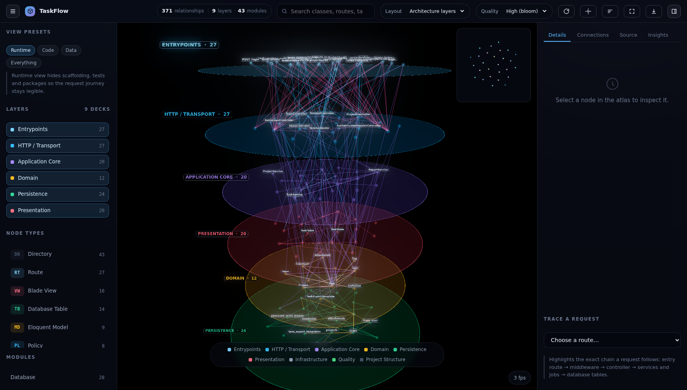

---

## What it does

```
   upload .zip  ──▶  language-aware scanner  ──▶  graph + insights  ──▶  3D atlas
```

1. **You upload** a `.zip` of a Laravel, C++, C# or Python project through the
   web UI. It is unpacked into private storage. Nothing is executed — the
   scanner is entirely static analysis. The language is detected from the
   archive: an `artisan`/`composer.json` project, a CMake or Visual Studio C++
   project, a `.sln`/`.csproj` .NET solution, or a `manage.py`/`pyproject.toml`
   Python project — and a folder that is simply a pile of `.py` files counts
   too, because that is how a lot of people meet Python. The archive's wrapper
   folder is stepped over automatically.
2. **The scanner** walks the project. Laravel gets composer manifest, file tree,
   PHP AST, `routes/*.php`, Eloquent models, migrations and Blade views. C++ and
   C# get their build manifests (CMake targets, `.sln` solutions, NuGet
   packages), a tolerant lexer and declaration parser, include/using resolution
   and a call graph. Python gets its `pyproject.toml` or `requirements.txt`,
   `urlpatterns` and Flask/FastAPI decorators, DRF routers and viewsets, Django
   models, migrations and templates. Either way it ends with how everything
   references everything else.
3. **The atlas** renders the result in the browser with three.js: nodes are
   instanced meshes sized by architectural weight, edges are one line buffer,
   and each layer floats as its own translucent deck.

| | |
|---|---|
| 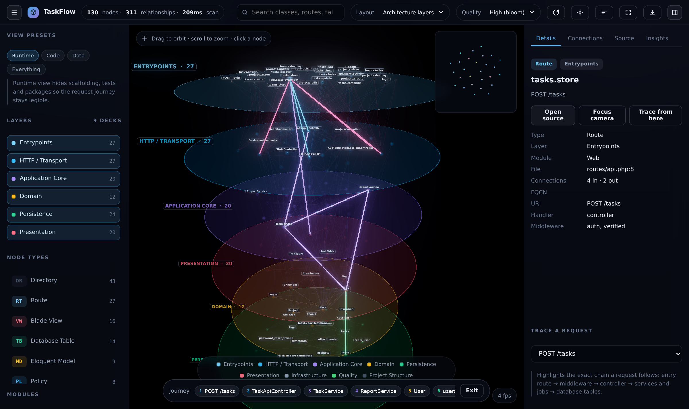 |  |
| **Trace a request** — pick a route and follow the exact chain through middleware, controller, services and the tables it writes. | **Open any node** — details, connections, source code with the relevant lines highlighted, and the insights that touch it. |
| 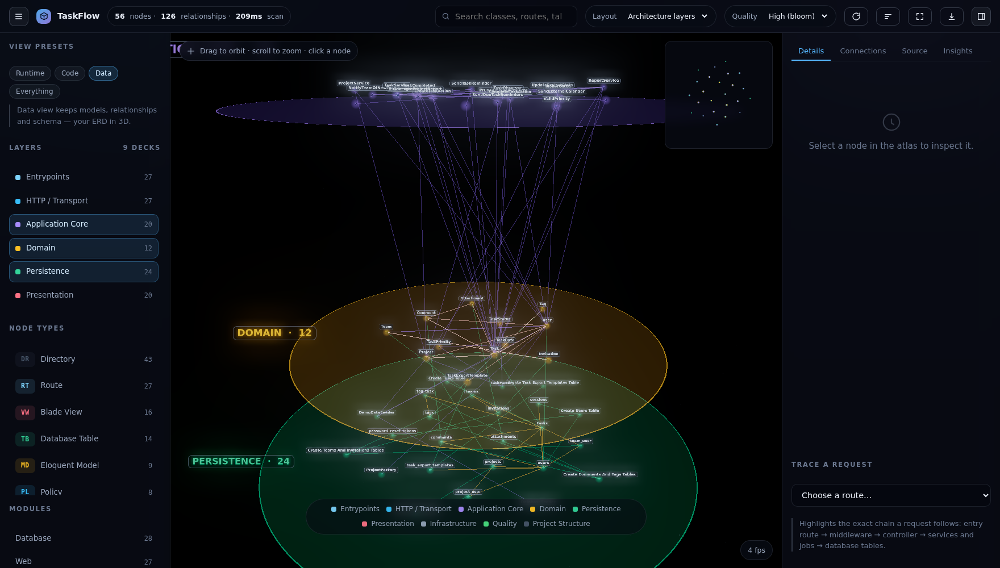 |  |
| **View presets** — Runtime, Code, Data (your ERD in 3D) and Everything, or filter by layer, type, module and relationship kind. | **Watch the scan** — the pipeline streams stage by stage with a live log. |

### Three ways to look at the same code

| | |
|---|---|
|  | 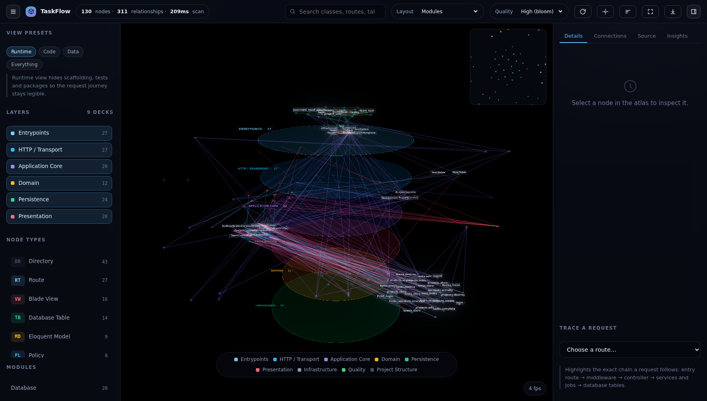 |
| **Architecture layers** — one deck per layer, entrypoints on top down to persistence. Reading the atlas top to bottom is reading a request's path. | **Modules** — one disc per module, packed by size, each node on its layer's shelf. Answers "which module owns what" without losing "where it sits". |
|  | 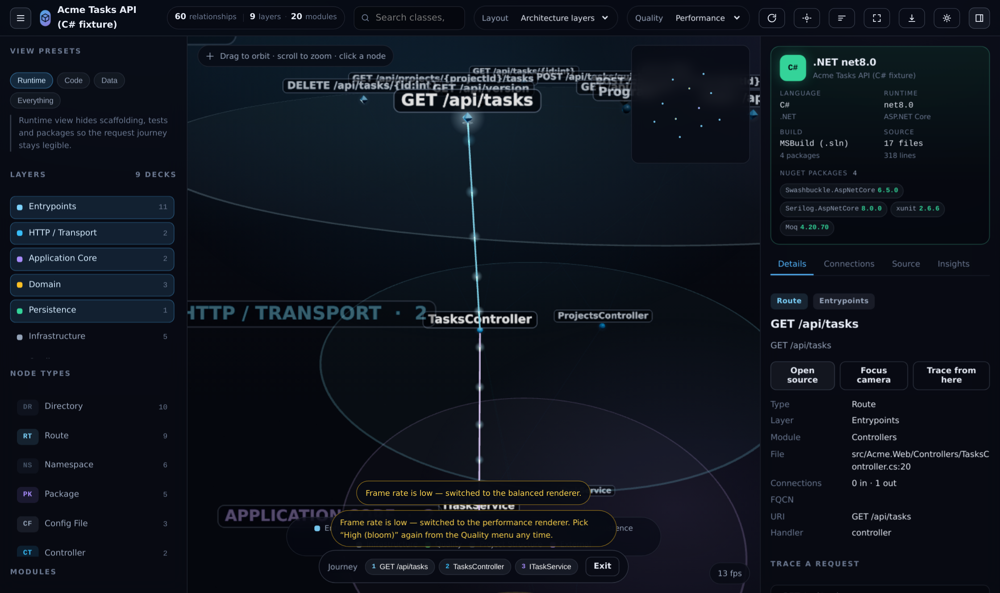 |
| **Spiral** — a helix ordered by layer, then by weight. The whole codebase as one strand, biggest nodes first. | **C# too** — an ASP.NET controller's `[HttpGet]` becomes a real route, and tracing it shows the controller and the service it calls. |

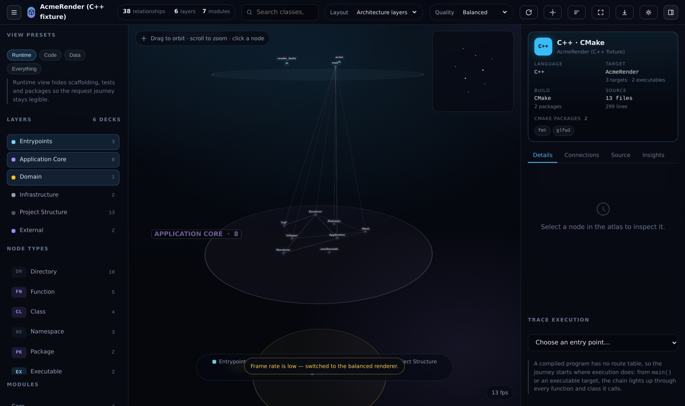

| | |
|---|---|
| 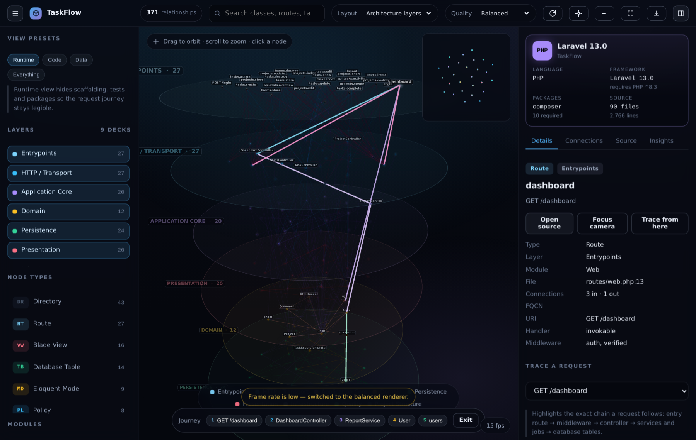 | 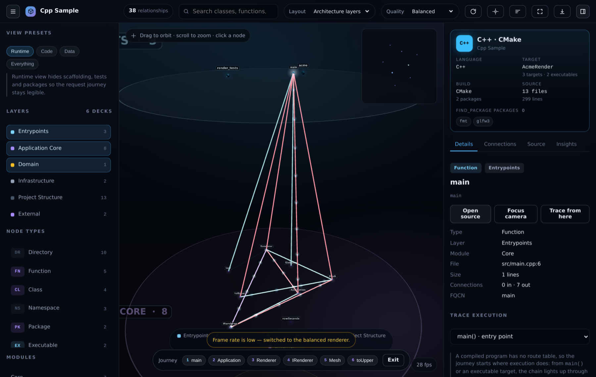 |
| **What it is built on** — language, framework or runtime, build system and named dependencies, always in view at the top of the right panel. | **Tracing a compiled program** — `main()` is the entry point, and the journey follows the calls down through the classes it uses. |

| | |
|---|---|
| 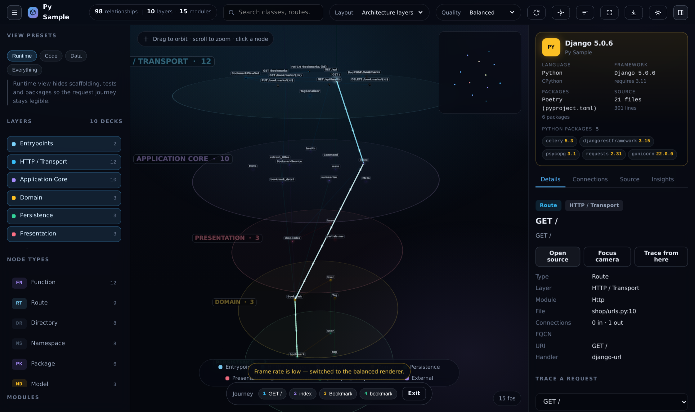 | 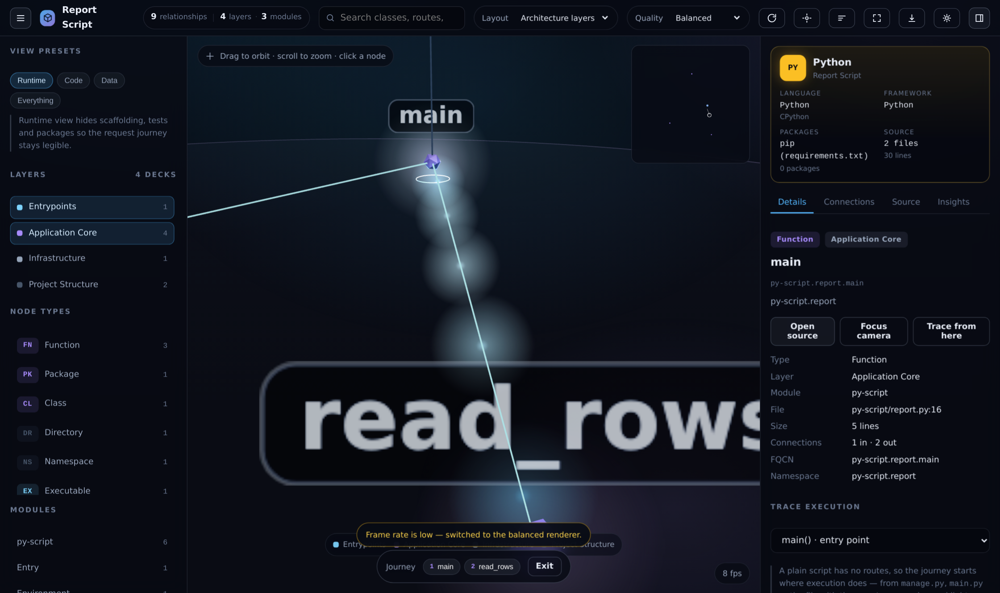 |
| **A Django request** — the route table is real, so `GET /` (Django's `path("", …)`) traces through the view, the model and the template that renders it. | **A Python script** — no route table, so the tracer offers the entry points instead and the journey crosses the functions they call. |

| | |
|---|---|
| 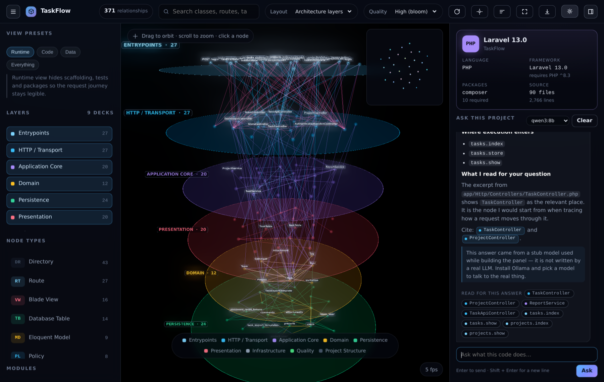 | 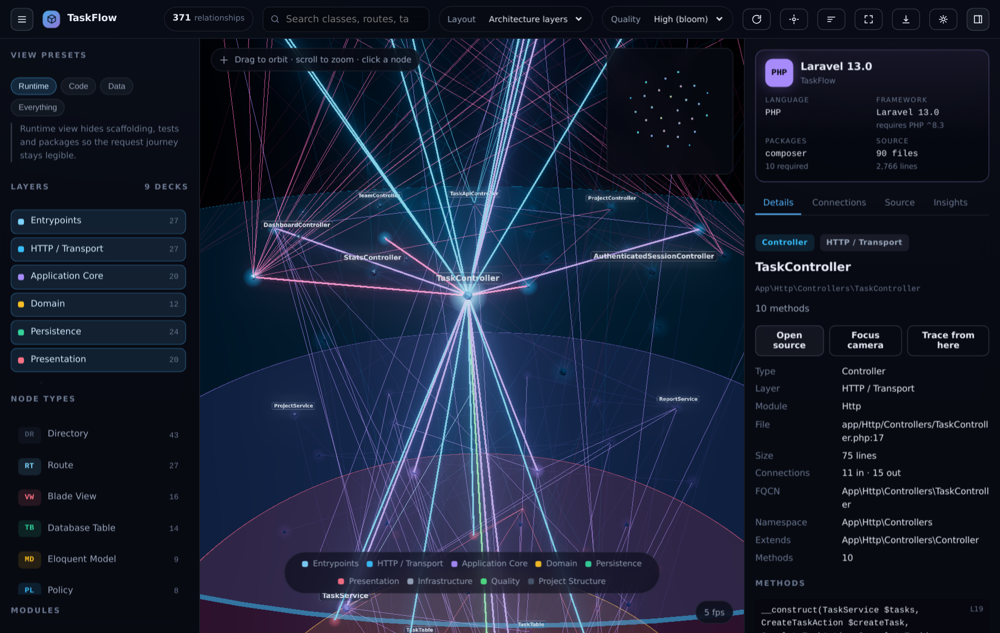 |
| **Ask the project** — a local model explains what the code does, from the graph and the files behind it. | **Citations are doors** — every answer links the nodes it used straight back into the atlas. |

| | |
|---|---|
| 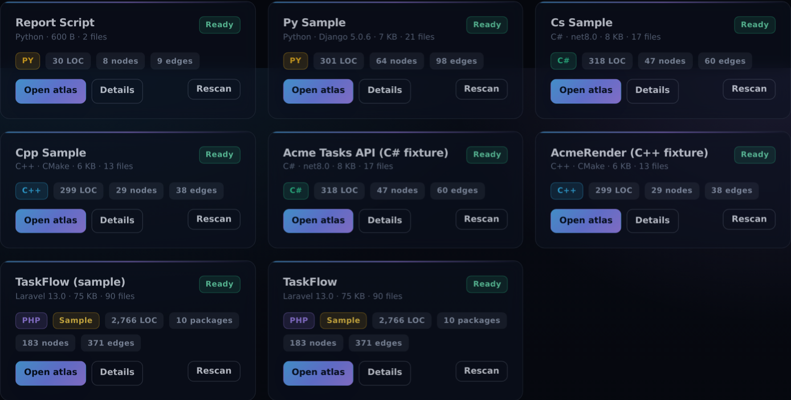 | |
| **Every language, one workspace** — PHP, C++, C# and Python sit side by side, each badge naming its framework, and the atlas adapts its wording, filters and tracer to suit. | |

---

## The local assistant

A panel that answers questions about *the project you have open* — what the
application does, what a file is for, where a request goes — **using a model
that runs on your own machine**. Nothing is sent anywhere, there is no API key,
no account and no per-question cost. Press **`a`** or the ✳ button in the top
bar: the assistant takes the inspector column, so the map keeps its width, and
the same button (or any citation) hands the column back.

| Ask | It answers with |
|---|---|
| "What does this application do?" | the stack, the layers and modules, the entry points, and where a request starts — the brief it was given before you asked |
| "What does `DashboardController` do?" | that class explained from its source, with the lines it read |
| "What calls `Renderer`?" | the graph's own edges, not a guess |
| "Where would I add a new feature?" | the layers and modules a change would touch |

Answers cite nodes as chips — click one and the atlas selects it, flies the
camera there and opens its source. The chips under an answer list everything the
retriever read, so when the model is wrong you can see exactly why.

### What an answer looks like while you wait

A local model is not instant, and most of the wait is not the model — it is the
atlas finding and reading the right files first. All of it is visible, so a
slow answer reads as work rather than as a hang:

1. **The atlas reports itself.** Within a moment of asking, the answer box shows
   the trail — *Searching the graph for "dashboard", "controller" → 8 nodes look
   relevant → Reading 8 files* — with each file named as it is read, and whether
   the model has actually started.
2. **The model's reasoning, live.** Reasoning models (`qwen3`, and anything else
   that emits a thinking stream) write their notes into a collapsible panel under
   the trail as they produce them, so you can watch it choose the file to cite.
3. **The answer types itself.** Words appear as the model produces them, with a
   caret at the end of the sentence being written rather than a spinner.
4. **It settles into a recap.** When the answer stops, the trail folds into one
   line — *8 files read · 8 nodes cited · 14.1 kB of context* — which stays
   clickable for the rest of the conversation.

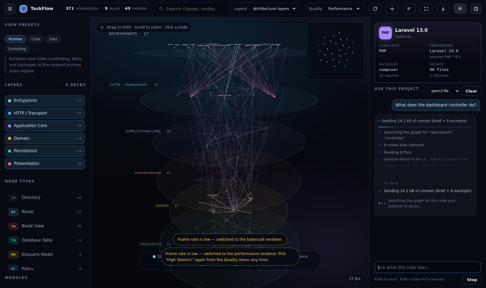

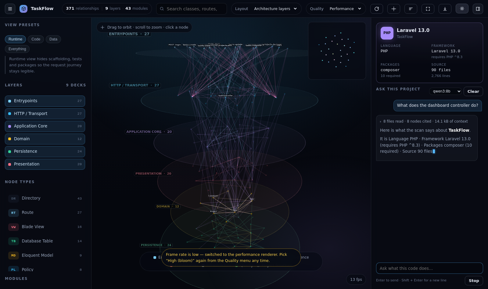

If nothing has been written after eight seconds, the waiting line starts counting
the seconds — at that point the honest answer is usually a smaller model.

### Setting it up (once, about five minutes)

1. Install **Ollama** — [ollama.com/download](https://ollama.com/download) (macOS,
   Windows, Linux).
2. Pull a model:
   ```bash
   ollama pull qwen3:8b          # 8B, ~5 GB — the default: good balance on a 16 GB laptop
   # or, if you have the room and want better explanations:
   ollama pull phi4:14b          # 14B, ~9 GB
   # or, if you want it fast above all:
   ollama pull llama3.2:3b       # 3B, ~2 GB
   ```
3. Open the assistant in the atlas. It talks to `http://127.0.0.1:11434`; if
   nothing is listening, the panel says so and lists those commands itself.

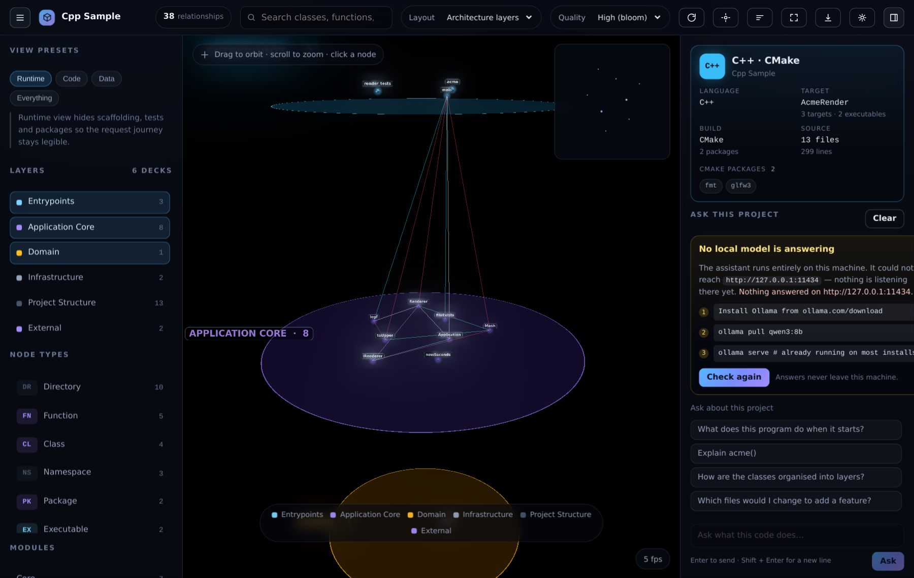

It works the same on a compiled project — the brief reports entry points instead
of routes, and the answers cite `main()`, classes and free functions:

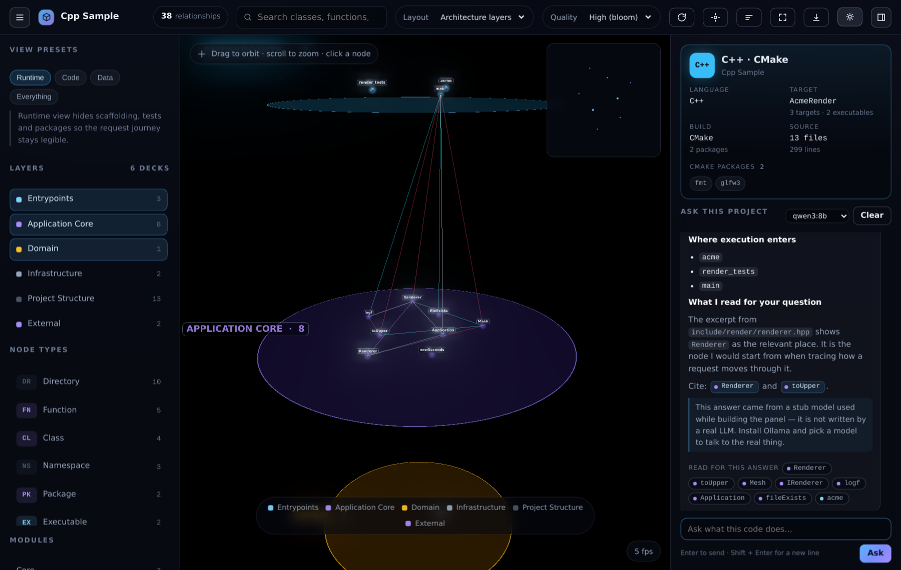

And the same on a Python one, where the suggestions follow the project: a Django
app is asked about its routes and models, a script about what it does when it runs
and which files to change to add a feature:

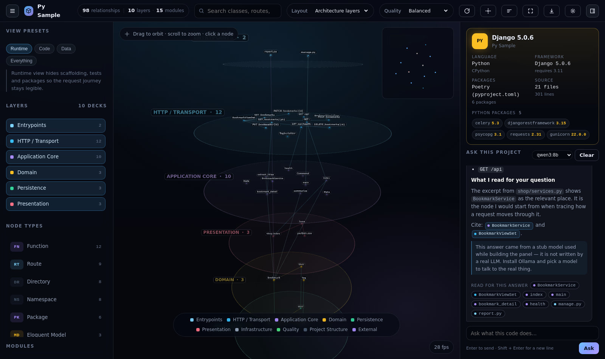

One implementation note, because it is the difference between an answer that
types and one that lands all at once: PHP's built-in server — the one
`php artisan atlas:serve` starts — holds each response in a ~4 KB buffer and
hands it over only when the buffer fills, and neither `flush()` nor the content
type changes that. Every streamed event therefore carries a little whitespace
behind it to push it out. On nginx or php-fpm the padding is harmless; on the
built-in server it is what makes the assistant live.

Served from a different machine, or running LM Studio instead? Both are one
value in `.env`:

```dotenv
ATLAS_AI_BASE_URL=http://127.0.0.1:11434   # any OpenAI-compatible runtime
ATLAS_AI_MODEL=qwen3:8b                    # what to use by default
ATLAS_AI_ENABLED=true                      # false removes the panel entirely
```

### How it knows your project

Roughly a 4 KB brief per project — stack, size, layers, modules, entry points,
insights and a key index — is composed once per scan and cached. Per question,
the graph is searched for the names the question contains and the top nodes are
turned into source excerpts using the line numbers the scan already stored
(plus the edges between them, so structural questions are answered from the
graph rather than by reading text). That whole prompt is about 15 KB, whether
the project is 300 lines or 300,000.

**Being honest about what to expect:** a 7–9B model on a laptop explains
structure and files well and streams at roughly 10–30 tokens a second; the first
token takes 1–4 seconds. It is not a substitute for reading the code, and it
will occasionally be wrong — which is why every answer shows what it read.

### Developing without a GPU

`drivers/stub-ollama.js` speaks Ollama's `/api/tags` and `/api/chat`, streaming
a reply derived from the prompt it receives. It lets the panel, streaming,
citations and error handling be developed and tested on any machine:

```bash
node drivers/stub-ollama.js      # stands in on 127.0.0.1:11434
```

---

## Requirements

| | |
|---|---|
| PHP | 8.3+ (8.4 tested) with `ext-zip`, `ext-sqlite3` |
| Node | 20+ (to build the front-end assets) |
| Database | SQLite by default — nothing to configure |
| Queue | optional; see [Running a scan](#running-a-scan) |

## Install

```bash
composer install
npm install
cp .env.example .env
php artisan key:generate
php artisan migrate
npm run build        # or: npm run dev
php artisan serve --host=0.0.0.0
```

Open <http://localhost:8000>. Click **Explore the sample project** for a
ready-made demo (TaskFlow, ~90 files) or upload your own archive.

## Running a scan

Scans run on a queue so the upload request returns immediately.

```bash
# in one terminal
php artisan queue:work --queue=atlas
```

If `QUEUE_CONNECTION=sync` (the framework default), scans run inline and no
worker is needed. You can also force either behaviour explicitly:

```dotenv
ATLAS_SYNC_SCANS=true    # always scan inline, no worker required
ATLAS_VERBOSE_SCANS=true # stream every stage to the console
```

While a scan is queued and no worker is consuming, the atlas says so on screen
and tells you the exact command to run — it never just spins.

From the CLI:

```bash
php artisan atlas:scan /path/to/laravel-app --name="My App" --verbose-stages
```

## Uploading your project

AtlasScope accepts a `.zip` of a Laravel project. **Never include `vendor/` or
`node_modules/`** — the scanner is fully static, it reads your own source plus
`composer.json`, and a vendor tree is 200× the useful payload:

```bash
cd /path/to/your-app
zip -r project.zip . -x "vendor/*" -x "node_modules/*" -x ".git/*" \
                      -x "storage/*" -x "public/build/*" -x "bootstrap/cache/*"
```

The landing page always prints the ceiling that applies to *this* server, which
is the lowest of `upload_max_filesize`, `post_max_size` and
`atlas.max_archive_bytes`, read live from `GET /api/atlas/capacity`. Started with
`composer serve` that is the natural 150 MB; with a bare `artisan serve` it is
whatever `php.ini` says, which on a stock PHP is 2 MB. Guards:

* the browser checks the file size before submitting and tells you the number and
  the fix, instead of letting the request die;
* if a body is still too large for PHP, you get a readable **413** page with the
  current limits and the `zip -x` recipe, not a blank 419 or a stack trace.

### Large archives just work — no configuration

PHP's `upload_max_filesize` and `post_max_size` only govern **multipart form
uploads**. A raw request body is not form data, so neither limit applies to it —
measured on a stock install configured for 2 MB, a 12 MB body arrives intact.

AtlasScope uses that: when an archive is bigger than the PHP limit, the browser
slices it into ~1 MB pieces, streams them to `PUT /uploads/{token}`, and the
server stitches them back together before unpacking. You get a progress bar, and
it works on an untouched `php artisan serve`, behind a proxy, on shared hosting —
**no php.ini, no restarts, no terminal commands.**

| What you want | What to do |
|---|---|
| Upload up to 150 MB | nothing — the default, streamed in pieces when needed |
| Upload more than 150 MB | `ATLAS_MAX_ARCHIVE_BYTES=1073741824` in `.env` |
| Also raise PHP's own limits (local dev) | `composer serve` → `php artisan atlas:serve` |

Setting up Herd, Valet, Sail, XAMPP, MAMP or a Linux server? Step-by-step paths,
verification commands and the seven reasons a changed limit "does not stick" are
in **[docs/SERVER-SETUP.md](docs/SERVER-SETUP.md)**.

The landing page prints the live ceiling from `GET /api/atlas/capacity` and says
which limit is in play, and a file over the ceiling is never a dead end: you get
an **Upload it anyway** button and a readable error if the server still refuses.

> **Two gotchas worth knowing.** `php -d upload_max_filesize=150M artisan serve`
> does *not* work — `artisan serve` spawns a **child** `php -S` and the `-d` flags
> die with the parent; `php artisan atlas:serve` puts the flags on the child
> invocation, which is the only place they matter. And the reason a big upload
> "just fails" on a stock server is that PHP discards the body *before* Laravel
> runs, so there is no CSRF token and the old symptom was a confusing 419.

## What the scanner extracts

Eleven stages run in order, each writing a JSON artefact to
`storage/app/atlas/{project}/.atlas/` so the intermediate understanding of your
code is inspectable, not just the end result.

| # | Stage | Produces |
|---|-------|----------|
| 01 | Extract | Safe unzip, root detection, size + file measurement |
| 02 | Manifest | `composer.json` → framework version, packages, config surface |
| 03 | FileIndex | File tree, LOC per file, language mix |
| 04 | ClassParse | AST → classes, methods, imports, attributes, extending/implements |
| 05 | Route | Route files reconstructed: verbs, URIs, names, middleware stacks, controller actions |
| 06 | Models | Eloquent models, `$fillable`, `$casts`, relationships, policies |
| 07 | Schema | Migrations → tables, columns, foreign keys |
| 08 | Views | Blade views, components, `<x-…>` usage, `@include` graph |
| 09 | Links | Reference resolution — short class names to FQCNs, then edges |
| 10 | Insights | Coupling hotspots, layering violations, policy/test/database gaps |
| 11 | Layout | Deterministic 3D projection: layers become decks, golden-angle spiral inside them |

Three projections are available in the atlas — **Architecture layers**, **Modules**
and **Spiral** — all reprojected in the browser from the same graph.

Node types include routes, controllers, middleware, form requests, API
resources, policies, models, services, actions, jobs, events, listeners,
notifications, mailables, commands, observers, rules, enums, DTOs, providers,
config files, Blade views, Livewire components, migrations, database tables,
factories, seeders, tests and composer packages.

Relationship kinds: `http`, `guards`, `validates`, `authorizes`, `uses`,
`injects`, `dispatches`, `renders`, `includes`, `persists`, `owns`,
`belongs_to`, `pivot`, `migrates`, `extends`, `tests`, `provides`, `queue`,
`notifies`, `schedules`, and more.

### Python projects

Python is one of the most used languages in the world and a very common place to
start, so it is supported the same way the other three are — not by a shallow
file listing:

| # | Stage | Produces |
|---|-------|----------|
| 01 | File tree | Files, LOC, and the project shape: `__pycache__`, `.venv`, `.tox`, `site-packages` and vendored `third_party/` are skipped, so the graph is the code and not the machine |
| 02 | Build | `pyproject.toml` (PEP 621 and Poetry), `poetry.lock`, `requirements.txt`, `Pipfile` → build system, interpreter, packages, and the framework it identifies — Django, Flask, FastAPI, DRF, Celery |
| 03 | Index | Python-aware file index: every module by its dotted name, so `shop.models` is a module and `shop` is its package |
| 04 | Declarations | Classes, protocols and ABCs, functions, methods, module variables, `self.x` fields, decorators, type annotations and base classes — including `models.Model` making a class a **model** and `APIView`/`ViewSet` making it a **controller** |
| 05 | References | `import x`, `from x import y`, `from . import z` and relative imports, resolved against the project's own modules and symbols |
| 06 | Calls | Call sites resolved through module aliases, local variables, `self.attr()` on a declared field type, and uppercase constructor chains → `calls` edges |
| 07 | Routes | `path()`/`re_path()`/`include()` urlpatterns, DRF `router.register()`, and `@app.route` / `@app.get` decorators — each becomes a real **Route** node with an `http` edge to its view |
| 08 | Models | Django `models.Model` subclasses → model nodes with fields, `ForeignKey`/`OneToOne`/`ManyToMany` → `belongs_to`/`owns`/`pivot` edges and real foreign-key columns on the table |
| 09 | Views | Django templates: ``, ``, blocks, and `render(request, …)` joining a view to its template |
| 10 | Insights | The graph-only findings, plus coupling hotspots and untested services |
| 11 | Layout | Identical to Laravel — the same decks, the same spiral |

A Django project therefore traces exactly like a Laravel one: pick `GET
/bookmarks/{pk}` and the journey runs route → view → service → model → template
(and the site root is a route too — `path("", …)` is how Django spells `/`).
The words follow the project as well: a Django model reads as **Model** rather
than *Eloquent Model*, a template as **Template** rather than *Blade View*, a
DRF serializer as **Serializer** — in the rail, the tooltip, the inspector search
and the project report's Composition table alike. Laravel keeps its own
vocabulary; only the projects that are not Laravel stop borrowing it.
A project with no routes at all — a script, a library — gets its entry points
instead: `manage.py`, `main.py`, or any file with an `if __name__ ==
"__main__"` guard. When there is neither a route nor an entry point, the panel
says so rather than showing an empty dropdown.

Inheritance is drawn between classes that live in the project, with a Protocol
or ABC base producing an `implements` edge and a plain class an `extends` one —
`class BookmarkCard(Renderable)` reads the same way `class Card : IRenderable`
does in C#. Bases that come from a framework (`models.Model`,
`serializers.ModelSerializer`) are deliberately not given edges when the project
does not contain them: there is nothing inside the codebase to draw a line to,
and inventing a node for every framework class would bury the ones that matter.

### C++ and C# projects

A second pipeline runs for compiled languages — same graph, same atlas, same
journey tracing, different evidence:

| # | Stage | Produces |
|---|-------|----------|
| 01 | Extract | Safe unzip, root detection (steps over the wrapper folder a zip always adds) |
| 02 | Build | `CMakeLists.txt` → targets, source lists, linked libraries, `find_package`; `.sln`/`.csproj` → projects, output types, `TargetFramework`, NuGet packages, `ProjectReference` edges |
| 03 | Files | File tree, LOC, profile-driven skips (`build/`, `bin/`, `obj/`, `third_party/`, `packages/`…) |
| 04 | Declarations | Lexer + declaration parser → namespaces, classes, structs, records, interfaces, enums, free functions, members, C# attributes |
| 05 | References | `#include` and `using` resolution, resolved against the project's own symbol table; inherited base types that live outside the project become external nodes |
| 06 | Calls | Call sites resolved through receivers, member types and qualified names into `calls` edges |
| 07 | Insights | The graph-only findings, plus wide interfaces, deep inheritance and unresolved-dispatch coverage |
| 08 | Layout | Identical to Laravel — the same decks, the same spiral |

Classes are classified into layers the way a reader would: tests by path or
attribute, ASP.NET `[ApiController]`/`[HttpGet]` types and methods onto the HTTP
deck, `*Service`/`*Controller`/`*Repository` by name, and everything else by the
project's own folder layout. `[HttpGet("{id}")]` on a method plus
`[Route("api/[controller]")]` on its class becomes a real **Route** node with an
`http` edge — so ASP.NET controllers trace like Laravel controllers do, and
minimal-API `app.MapGet("/api/health", …)` endpoints become routes too.

Where there is no route table to trace, the tracer starts where execution does.
It offers the project's entry points — `main()`, `WinMain`, an executable
target — and follows the `calls` edges from there, so tracing `main()` on the
C++ fixture walks `main → Application → Renderer → IRenderer → Mesh → toUpper`
and lights exactly those links. The **Routes** tile follows the same rule: a
graph with no routes reports **Entry points** instead of a lonely zero.

## Using the atlas

| Action | How |
|---|---|
| Orbit / zoom / focus | drag, scroll, click a node |
| Search | type in the top bar — an **×** appears inside the field to clear it (`Esc` while typing clears it too); `Enter` selects the strongest match |
| Trace a request | pick a route in **Trace a request** (inspector, bottom). A project with no route table — a compiled program, a Python script, a library — gets its **entry points** in the same list (`main()`, `WinMain`, `manage.py`, an executable target), and the journey walks the functions and classes it calls. The panel title and its note follow what the project actually has |
| Tech stack | the first thing in the right panel says what the app is built on: language, framework/runtime, build system and the named dependencies, with the counts the toolbar does not show |
| Switch layout | **Architecture layers / Modules / Spiral** in the top bar — a progress card in the bottom-right shows the engine rebuilding and then the nodes' actual travel, so a switch never looks like a freeze. Filtered-out nodes are held at their deck home so they slot back in when the filter is lifted |
| View presets | **Runtime**, **Code**, **Data**, **Everything** in the rail |
| Filter | click any layer, node type, module or relationship kind in the rail |
| Focus | selecting a node (or tracing a request) dims everything that is not on that path — toggle with the focus button in the top bar or `d` |
| Route focus | selecting a route greys out **every other route** and its glow, so the chosen route and everything connected to it are the only coloured things left |
| Journey | the tracer follows the request to the table it writes to and stops there, lighting **only the links the journey walks** — every other line that happens to touch a step is pushed back to 8% |
| Inspect | right panel: Details · Connections · Source · Insights — the Source tab reads PHP, C++, C# and Python files alike |
| Jump from an insight | open the **Insights** tab and click a finding |
| Minimap | click anywhere on it to fly the camera there |
| Export | the download button in the top bar → full graph JSON |

Keyboard: `f` fit, `l` labels, `d` dim-to-focus, `r` auto-rotate, `a` the assistant,
`Esc` clear selection (or clear the search while the search field has focus), `/` search.

The query is part of the URL, so a cleared search is cleared in the link too —
reloading or sharing never resurrects a query you just dismissed.

Views are deep-linkable — `?node=…&layout=…&view=…&q=…` — so you can send a
colleague the exact thing you are looking at.

If the frame rate drops (a big project plus bloom on integrated graphics), the
renderer steps itself down to the balanced or performance preset and tells you;
you can always pin it back from the **Quality** menu.

## HTTP API

Everything the UI does is available over JSON:

| Method | Endpoint | Purpose |
|---|---|---|
| `GET` | `/api/atlas/projects/{project}/graph` | Full renderer payload; `202 {ready:false}` while scanning |
| `GET` | `/api/atlas/projects/{project}/status` | Scan status, stage list, progress |
| `GET` | `/api/atlas/projects/{project}/events?after=` | Incremental scan log |
| `GET` | `/api/atlas/projects/{project}/nodes/{key}` | Node detail + incoming/outgoing edges |
| `GET` | `/api/atlas/projects/{project}/neighbourhood?key=&depth=` | Subgraph around a node |
| `GET` | `/api/atlas/projects/{project}/search?q=` | Search nodes |
| `GET` | `/api/atlas/projects/{project}/file?path=` | File contents (containment-checked, text files only) |
| `GET` | `/api/atlas/projects/{project}/export` | Download the whole graph as JSON |

`{key}` is a node key such as `class:App\Models\Task` or `route:GET /tasks`.
Keys are URL encoded in the path.

## Configuration

`config/atlas.php`:

```php
'max_archive_bytes' => env('ATLAS_MAX_ARCHIVE_BYTES', Ini::devBytes('upload_max')), // 150 MB ceiling
'max_extracted_bytes' => env('ATLAS_MAX_EXTRACTED_BYTES', 2_147_483_648), // zip-bomb guard, not a size policy
'sync_scans'        => env('ATLAS_SYNC_SCANS', env('QUEUE_CONNECTION') === 'sync'),
'verbose_scans'     => env('ATLAS_VERBOSE_SCANS', false),
'max_render_nodes'  => env('ATLAS_MAX_RENDER_NODES', 2500),
'max_render_edges'  => env('ATLAS_MAX_RENDER_EDGES', 6000),
'demo_enabled'      => env('ATLAS_DEMO_ENABLED', true),
```

Projects live in `storage/app/atlas/{uuid}` (private). Deleting a project from
the UI removes both its rows and its files.

If a scan ever dies before it finishes, the directory it was writing to is left
behind with no project pointing at it. `php artisan atlas:prune` finds those
(and upload chunks abandoned for more than `--uploads` hours) and removes them;
`--dry-run` lists what it would remove first. It refuses to do anything if the
database has no projects at all — from an empty database every workspace looks
orphaned — so a mis-scoped run cannot delete live projects. Pass `--force` when
you really do mean it.

## Project structure

```
app/
  Console/Commands/ScanProjectCommand.php   php artisan atlas:scan
  Enums/                                    NodeType, Layer, EdgeKind, ScanStage, ScanStatus
  Http/Controllers/                         ProjectController (UI + API), AtlasApiController
  Jobs/RunScan.php                          queued scan worker
  Services/ProjectManager.php               upload → unpack → project row → scan
  Services/GraphPayload.php                 renderer payload shaping
  Services/Scan/ScanPipeline.php            runs the stages, persists the graph
  Services/Ai/                              the local model: OllamaClient, ProjectBrief,
                                            ContextBuilder (the retrieval that feeds the panel)
  Services/Scan/ScanPipelineFactory.php     assembles the right pipeline per language
  Services/Scan/Languages/                  LanguageProfile + Laravel/C++/C#/Python profiles,
                                            ProfileRegistry (detection + scoring)
  Services/Scan/Languages/Cxx/              Lexer, DeclarationParser, SymbolClassifier,
                                            Naming, CxxInsights + the four C-family stages
  Services/Scan/Parsers/                    Composer, FileIndex, ClassParse, Route, Model,
                                            Migration, View
  Services/Scan/Stages/                     the Laravel stages (shared: Extract, Insights, Layout)
  Support/                                  Path sandbox, GraphBuilder, NameResolver
resources/
  css/app.css                               hand-written design system (no utility framework)
  js/atlas/                                 api, store, layouts, scene, inspector, trace, scan, ai, ui
  views/                                    landing, project report, atlas
```

## Tests

```
php artisan test          # 31 tests covering every pipeline and the assistant
```

`tests/Feature/AtlasWorkflowTest.php` drives the Laravel promise: upload a zip,
scan it, open the atlas, read source back out, search the graph.
`tests/Feature/MultiLanguageScanTest.php` does the same for C++, C# and Python —
the stage plans per language, language detection from a wrapped archive, CMake
targets, .NET project references, the routes ASP.NET attributes produce, the
`urlpatterns`, Django models and templates Python produces, Python inheritance
inside a project (`extends` for a class, `implements` for a Protocol), a folder
of loose scripts being recognised as Python at all, a project with nothing to
trace saying so, the router's trailing-slash trim not hiding the site root, and
every parser's handling of destructors, generics, type annotations and awkward
lexer input.
`tests/Feature/AiAssistantTest.php` runs the assistant against a fake provider:
that the brief describes the project, that the retriever picks the class a
question names and hands the model its source, that the reply streams back as
NDJSON with openable citations, and that a machine with no model installed is
told so in plain words.

```bash
php artisan test
```

## Notes & limits

- Static analysis only: no code from an uploaded project is ever executed.
- The parser reads PHP with `nikic/php-parser`; it does not boot the target app,
  so dynamic container binding and runtime-computed routes are out of reach.
- Extremely large graphs are thinned to `max_render_nodes` / `max_render_edges`
  before rendering; everything is always present in the JSON export.
- The layout is deterministic — the same project always lands in the same place,
  which makes scans comparable over time.

<div align="center"><sub>Built with Laravel 13, three.js and nikic/php-parser.</sub></div>
