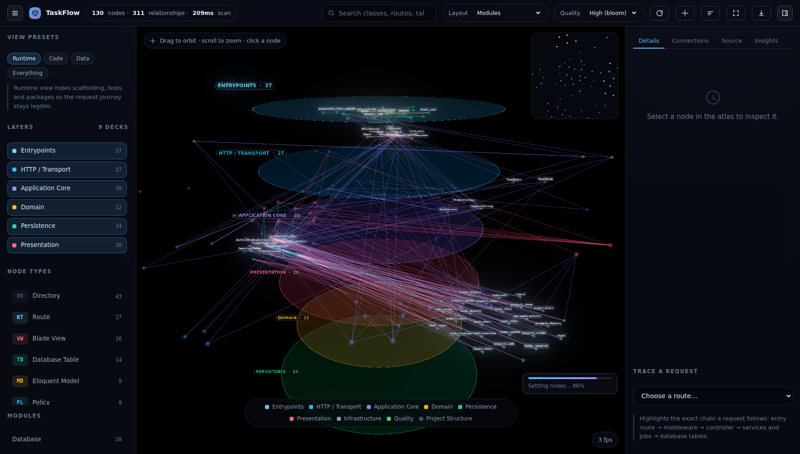

# AtlasScope — how it is put together

A short tour for whoever reads the code next. The `README.md` covers usage.

## The pipeline

An upload becomes a graph in a fixed sequence of stages, driven by
`ScanPipeline`. Which sequence depends on the language, and that is decided by
the project's profile — `ScanPipelineFactory` assembles the list, so a stage
never has to ask what it is scanning.

```
Laravel  Extract → Manifest → FileIndex → ClassParse → Route → Models →
         Schema → Views → Links → Insights → Layout

C++ / C# Extract → Build → FileIndex → Declarations → References → Calls →
         Insights → Layout

Python   Extract → Build → FileTree → Declarations → References → Calls →
         Routes → Models → Views → Insights → Layout
```

`Extract`, `Insights` and `Layout` are shared. The Laravel stage list is
unchanged from before the compiled languages existed — that was a hard rule, not
a happy accident: `ScanStage::planFor('php')` returns `pipeline()` verbatim, and
`ScanPipelineFactory::planNames(Language::Php)` is asserted in the test suite.

## Languages are profiles, not branches

`Language` is an enum of what the scanner can read (`php`, `cpp`, `csharp`,
`python`).
Everything else the scanner needs to know about a language lives in a
`LanguageProfile`: how to score a directory, which stages to run, how a path
becomes a module name, which folders are noise, which extensions are source, and
what to call a file's language in the index.

`ProfileRegistry` combines them:

- `detect()` scores a directory with every profile and returns the highest —
  `null` below 20, so a stray `.cs` file in a docs folder cannot turn a project
  into a C# solution.
- `detectWithin()` walks a bounded depth for the most project-like directory. A
  zip always arrives inside a wrapper folder (GitHub's "Download ZIP", Finder's
  "Compress"), and that wrapper tells us nothing; the real root is one level
  down, where the `.sln` or `CMakeLists.txt` lives.
- `for(Language)` hands a stage the profile it was built for.

`RunScan` calls `detectWithin()` before the pipeline starts, records the chosen
language on the project row (so the stage plan of an already-finished scan is
still correct later) and re-points the scan root if a wrapper folder was stepped
over.

### The C-family stages

`Services/Scan/Languages/Cxx/` holds everything C++ and C# need:

| Piece | Why it exists |
|---|---|
| `Lexer` | One tolerant single-pass lexer for both languages: comments, C# verbatim/interpolated strings, C++ raw strings, char literals, continued `#` directives. It never throws — real-world code is not always valid. |
| `DeclarationParser` | Token-stream parser producing namespaces, types (with bases and members), free functions, includes, usings and call sites. It knows the lexer's contract: `::` arrives as two `:` tokens, and nothing is matched as a string. |
| `SymbolClassifier` | Turns a declaration plus its file path into a `NodeType` and a `Layer`, and records which rule fired in the node's metadata. Tests by path or attribute, C# attributes before names, names before folder layout. |
| `Naming` | One place for the naming rules: keys are always backslash-separated (`type:Acme\Web\TasksController`), C# is *displayed* with dots, and `refersTo()` is the honest suffix match C++ needs. |
| `CxxInsights` | Wide interfaces, deep inheritance chains, external base types, and how much of the call graph was unresolvable. The Laravel-only findings (policies, Eloquent, migrations) are skipped for these languages instead of reporting nonsense. |

The four C-family stages sit in `Cxx/Stages/`:

- **BuildStage** reads `CMakeLists.txt` (`add_executable`, `add_library`,
  `target_link_libraries`, `find_package`) or the `.sln`/`.csproj` set
  (`OutputType`, `TargetFramework`, `PackageReference`, `ProjectReference`).
  These become `executable`, `library` and `package` nodes — for a compiled
  project they are the top of the map, the thing everything else serves.
- **FileIndexStage** is the FileIndex stage with profile-driven skips
  (`build/`, `bin/`, `obj/`, `third_party/`, `packages/`) and profile-driven
  extensions. It *continues* the graph the build stage started; both live under
  `Cxx/Stages/` so the Laravel indexer stays untouched.
- **DeclarationStage** parses every source file into nodes, fills in members for
  types whose bodies are defined out of line in a `.cpp`, links inheritance
  (creating `external` nodes for base classes that live outside the project) and
  turns ASP.NET HTTP attributes into real `route:` nodes.
- **ReferenceStage** resolves `#include` to the *named* declaration in that
  header rather than whichever type happened to be declared first, resolves
  `using` directives to namespace nodes, and derives `uses` edges from member
  and return types.
- **CallStage** resolves call sites through the receiver, the caller's member
  types (`tasks.All()` where the caller declares `ITaskService tasks`), qualified
  owners and free-function names — and counts what it could not resolve rather
  than inventing an edge.

### The Python stages

`Services/Scan/Languages/Python/` mirrors the C-family arrangement, for the same
reason: a second language's quirks should not leak into the first one's stages.

| Piece | Why it exists |
|---|---|
| `PythonIndex` | The file index knows what a *module* is in Python: `shop/models.py` is `shop.models`, a package is its own module, and `__pycache__`, `.venv`, `.tox` and vendored trees are skipped rather than scanned. |
| `PythonParser` | An indentation-aware parser — Python's block structure is whitespace, so the lexer cannot be line-agnostic. It produces classes (with bases, decorators, `self.x` fields), functions, methods, module variables, call sites and import statements, including relative `from . import x`. It is deliberately built from the *same records* the Laravel AST parser produces (`arguments()`, `bases()`, `variables[]`), so downstream stages can treat both alike. |
| `PythonSymbolClassifier` | Name and shape → `NodeType` + `Layer`: `models.Model` and ORM bases become models, `APIView`/`ViewSet`/`@app.route` handlers controllers, `Serializer` resources, `Command` commands, `Protocol`/`ABC` interfaces, tasks and jobs, `settings` config. Everything it decides carries its rule in the node's metadata. |
| `PythonProfile` | Detection and skips. Scores `manage.py` (34), a packaging manifest (30), requirements/setup files (22), conventional directories, and `.py` files themselves at 10 each — two loose scripts clear the registry's 20-point floor, because a folder of scripts *is* a Python project and that is how a lot of people meet the language. |
| `Stages/` | `BuildStage`, `DeclarationStage`, `ReferenceStage`, `CallStage`, `RouteStage`, `ModelStage`, `ViewStage` — the same vocabulary as Laravel's, because Python genuinely has those concepts. A project without routes or models simply produces no nodes for them. |

What the stages do with Python's idioms:

- **BuildStage** reads `pyproject.toml` in both spellings (PEP 621
  `[project]` and Poetry `[tool.poetry]`), `poetry.lock`, `requirements.txt` and
  `Pipfile`, and names the framework from the dependency list — Django (with its
  version, read off the lock file), Flask, FastAPI, DRF, Celery.
- **RouteStage** understands three ways to spell a route: `path()`/`re_path()`
  in a urlpatterns list (including `include()` of another module),
  `router.register()` from DRF, and decorators (`@app.route`,
  `@app.get`, `@blueprint.route`). Django's `<int:pk>` converters are
  normalised to Laravel's `{pk}` spelling so the two read the same in the atlas —
  and `path("", …)` is the site root, not a missing argument.
- **ModelStage** reads Django model bodies: fields become columns, and
  `ForeignKey`/`OneToOne`/`ManyToMany` become `belongs_to`/`owns`/`pivot`
  edges *plus* a real `<name>_id` column on the table, because that is the column
  the database has.
- **ViewStage** parses Django templates: `` and ``
  become edges, and `render(request, "shop/index.html")` joins the view to its
  template.

Inheritance is resolved only inside the project — a base the project does not
contain draws nothing. The alternative, which the C-family pipeline takes, is to
invent a node for every framework base type; for Python that would mean a node
for `models.Model` on every Django model and bury the edges that matter. The
edge kind follows the *base*: a `Protocol` or ABC is `implements`, a class is
`extends` — the same rule `Cxx/Stages/DeclarationStage.php` applies.

Two rules hold the design together:

1. **Stages communicate through files, not memory.** Each one reads and writes
   JSON under `{workspace}/.atlas/` through `ScanContext`, so a scan can be
   replayed stage by stage and every intermediate understanding of the target
   project is inspectable.
2. **`GraphBuilder` is the single mutable graph.** Stages add nodes and edges to
   it; nothing else does. Node keys are stable and human readable:
   `class:App\Models\Task`, `route:GET /tasks`, `table:tasks`,
   `view:tasks.index`, `package:laravel/framework`.

`LayoutStage` is last and turns the graph into coordinates: one horizontal deck
per architectural layer, nodes placed inside it by a golden-angle spiral sorted
by module. The result is deterministic — the same project always lands in the
same place, so two scans can be compared side by side. Those coordinates are the
**Architecture layers** view; the browser can also reproject the same graph into
three other views (see *The layout engines*).

## The payload

Node type labels are spoken in the project's language — `NodeType::label()`
takes the language and returns `Model`/`Template`/`Serializer` for Python where
Laravel would read `Eloquent Model`/`Blade View`/`API Resource`. The override
table is deliberately tiny: it holds only the types whose framework name would be
*wrong* elsewhere, and everything else falls through to the neutral label.

`app/Services/GraphPayload.php` shapes the persisted graph into exactly what the
renderer needs (`nodes`, `edges`, `layers`, `types`, `clusters`, `edge_kinds`,
`metrics`, `insights`, `limits`) and hands it to the atlas over
`GET /api/atlas/projects/{project}/graph` — with a `202 {ready:false}` while a
scan is still running, which the front end polls.

## The front end

`resources/js/atlas/` is plain ES modules on top of three.js. `main.js` is the
only place that knows about all of them:

| module | responsibility |
|---|---|
| `api.js` | endpoint client, reading the `data-*` contract on `#atlas` |
| `store.js` | graph index, visibility bitmaps, filters, selection, events |
| `layouts.js` | three layout engines (layers, modules, spiral) |
| `scene.js` | the renderer: instanced nodes, one edge buffer, decks, labels, bloom, picking, camera tweens, the focus/dim engine |
| `inspector.js` | the four-tab right panel, source viewer, insights |
| `trace.js` | walks a project's journeys into a readable chain: a route's outgoing flow edges for Laravel and ASP.NET, or a compiled project's entry points (`main()`, `WinMain`, an executable target) through `calls` / `imports` |
| `ai.js` | the assistant panel: streams an answer from `/ai/ask`, renders it as it arrives, turns `[[key]]` citations into buttons that open the node |
| `markdown.js` | the panel's own renderer — answers are prose with code, and a local model must not depend on a CDN |
| `ui.js` | rail, legend, minimap, tooltips, toasts |
| `scan.js` | the live scanning overlay |

`resources/css/app.css` is a hand-written design system — no utility framework,
on purpose. Reuse the existing classes (`atlas`, `hud-pill`, `rail-item`,
`metric`, `card`, `chip`, `legend`, …).

### Render quality

The Quality menu switches between three tiers. They differ in *definition*, not
just in how much there is, and every knob lives in the `QUALITY` table at the top
of `scene.js`:

| knob | what it buys |
|---|---|
| `samples` | MSAA on the post-processing buffers. `antialias: true` on the renderer does nothing once a composer is in the chain — `EffectComposer`'s default target is allocated without multisampling — so this is what keeps node silhouettes smooth on the bloom path. |
| `bloomStrength` / `bloomRadius` / `bloomThreshold` | How much light blooms and how far it spreads. A low threshold blooms the whole frame and lifts every dark shape into the haze around it; a high one blooms only what is genuinely bright. |
| `labelBoost` | Label textures are painted at `devicePixelRatio * labelBoost`. Sprites are rescaled by distance, so magnified text needs pixels that were never there — this is the difference between legible text and a smear. |
| `edgeWidth` / `edgeOpacity` | Relationship lines are fat lines sized in CSS pixels. Plain `LineSegments` are always one device pixel wide — WebGL ignores `linewidth` — which is why they smeared at distance. |

Two things are easy to get wrong here, and both are handled in `setQuality()`:

* A render target's `samples` count is fixed when it is allocated, so a tier
  switch has to hand the composer fresh buffers (`#syncComposerSamples()`);
  `bloom.enabled = false` alone leaves the previous tier's multisampling behind.
* `EffectComposer` captures `renderer.getPixelRatio()` at construction and
  caches it, so `composer.setPixelRatio()` has to be re-stated after the renderer
  changes density — otherwise the post path keeps rendering at the old one.

Edge geometry is one interleaved buffer pair (`instanceStart` / `instanceColorStart`),
which the line geometry *adopts* rather than copies. In-place edits to edge
positions or colours therefore mark the `InterleavedBuffer` dirty
(`getAttribute('instanceStart').data.needsUpdate = true`) — the attribute itself
has no `needsUpdate`.

## The layout engines

`resources/js/atlas/layouts.js` holds three engines behind one dispatcher,
`computeLayout(mode, nodes, edges, visible)`. Each returns a flat `Float32Array`
of `[x, y, z]` triplets indexed by node index, so `scene.setLayout()` is the same
call whatever produced the numbers.

| mode | shape | answers |
|---|---|---|
| `layers` | the server's decks, verbatim | where does this live in the architecture? |
| `modules` | one disc per module, packed outward from the centre, every node on its layer's shelf | which module owns what? |
| `spiral` | one helix ordered by layer, then weight | the whole codebase as a single strand |

Rules the engines have to follow:

- **Tiers come from the layer slug.** The payload carries `layer` (and
  `layer_label`), *not* a `layerTier` field — reading one silently returned
  `undefined` for every node, which flattened the module map onto a single plane
  and made the spiral's "layer, then importance" sort a no-op. `LAYER_TIERS`
  mirrors `App\Enums\Layer::tierSlot()` so the browser agrees with the decks.
- **A cluster is a disc, and discs must not touch.** A cluster's radius is
  `30 + 17·√size`; the module map walks a golden-angle spiral and takes the first
  spot that clears every disc already placed (14 % clearance), biggest first. Do
  not go back to a ring of fixed radius: it has to be sized for its two widest
  neighbours, and on the sample project that inflated the map to 3 300 px across.
- **A layout switch frames where the nodes are going.** `fitAll()` measures node
  positions to build its box, and during a switch those positions are still the
  *old* layout's: the camera framed the view the user had just left while the new
  one animated in off screen (this is what "Modules is empty" was). The switch
  calls `fitAll(true, { useTarget: true })`.

### Switching layouts reports itself

A switch is two waits, and both are visible. `main.js#applyLayout()` shows a
progress card in the bottom-right of the stage, yields two frames so it paints,
runs the engine, then hands the graph to the scene. From there `AtlasScene` reports real progress: `setLayout()`
records the total distance every node still has to travel, and each frame that
distance is re-measured, so the bar shows the fraction of travel completed — a
number that comes from the animation itself rather than a timer. It reads
"Building … layout" (an indeterminate sweep, because an engine's remaining work
genuinely is not known) and then "Settling nodes … 82 %", and hides once the
morph has snapped into place.



Measured on the sample project (130 visible nodes, software renderer, all three
modes): every layout lands inside the frame with **0 overlapping pairs**, and the
settled boxes are layers `249×529×240` (min gap 41.7), modules `894×480×903`
(35.1) and spiral `569×1701×569` (54.4).

`computeLayout()` falls through to the architectural decks for anything it does
not recognise, so a `?layout=` link from before a mode was retired still lands on
a real view.

## The focus engine (dim everything else)

Legibility at 180+ nodes comes mostly from what you *don't* draw. `scene.js`
keeps the full colour and opacity of every node, glow instance, edge and deck at
build time (`nodeBaseColors`, `glowBaseColors`, `edgeBaseColors`, per-deck
`baseOpacity`) and an `adjacency` map derived from the edges. `setHighlight()` /
`setTrace()` then only decide *where attention goes*:

- `focusKeys` = the selection ∪ its direct neighbours ∪ the traced path;
- `#tickFocus(delta)` eases a single scalar, `focusMix`, from the render loop —
  so the transition is animated but everything else stays declarative;
- `#applyFocus(mix)` re-tints from the recorded base colours: focused nodes get a
  small lift, unfocused ones drop to 0.2, lit glow goes ×1.45 against ×0.17,
  touched edges ×2.5 against ×0.14, and decks with nothing left in them fade out.

Focus has three tiers, not two, once a journey is being traced. `focusKeys` is
the path *plus every neighbour of every step* — right for a plain selection, but
on a journey that is dozens of nodes hanging off six steps, and lighting them all
equally is what made a traced chain look like one bright slab. So the chain gets
the lift, its neighbours recede to context, and the rest dims:

| tier | TaskFlow, `POST /tasks` traced | mean luma |
|---|---|---|
| the chain (6 nodes) | the request's own steps | 0.583 |
| context (51 nodes) | neighbours of the steps | 0.252 |
| everything else (126) | — | 0.058 |

Edges follow the same rule: while tracing, **only the journey's own links** are
lit (5 of 371 on TaskFlow) and every other line touching a step drops to 8%. The
bloom pass is pulled back as focus comes in (`0.62 → 0.36`) because it is
additive — the more bright geometry there is, the more the whole frame lifts —
and even a touched deck steps back 25%, since those big translucent discs were
most of the remaining glare.

The walk itself stops at a *terminal*: a table or a view is where a request ends,
so it is not penalised for having no next step (that penalty used to make the
journey prefer another model over the table it writes to). `uses` is
de-prioritised between two models for the same reason — it means "mentions this
class" and is exactly the right hop from a service, but noise from one model to
the next. Journeys are capped at 16 hops as a runaway guard; the old cap of 7 was
silently cutting 23 of TaskFlow's 27 journeys off at exactly 8 nodes, so the bar
was showing a truncated chain rather than the end of one.

Routes get a stronger treatment than the rest: when a selection is active, every
unfocused route is pulled towards its own luminance (`#desaturate()`, Rec.709
weights because three.js is working in linear space here) in both the node buffer
*and* the bloom buffer. There are dozens of routes on one deck, and they are the
thing a reader is usually hunting for — greying them leaves a single coloured
route and its neighbourhood. Measured on TaskFlow: mean chroma across the 27
routes falls 0.77 → 0.05 while the selected route holds 0.99 and its connected
nodes keep ~1.16.

The camera has the same "get out of the way" rule: `#moveCamera()` refuses to
start a tween while `controls.interacting` is set, so a scripted fly-to never
fights your hand.

## Failing loudly, in the app's own voice

Status pages are local Blade views (`resources/views/errors/`) with inline CSS —
no Vite manifest, no vendor assets, nothing that can itself 404. That matters
because the most likely failure in this app is a body PHP rejects before Laravel
boots: `upload_max_filesize` discards the POST, the CSRF token disappears, and
you get a 419 that has nothing to do with CSRF. The 419 and 413 pages therefore
print the live `upload_max_filesize` / `post_max_size` (`App\Support\Ini`) and the
`zip -x` recipe, and `bootstrap/app.php` only defers to Laravel's debug renderer
when its stylesheet actually exists on disk.

Two details there are easy to get wrong twice:

- `App\Support\Ini::capacity()` is the single source of truth for the limits, and
  `GET /api/atlas/capacity` serves it to the browser. The guard in `app.js` is
  *advisory* — it re-reads that endpoint on load, on focus and on file pick, and
  it always offers "upload anyway", so a stale or wrong number can never lock a
  legitimate upload out. PHP still gets the final word, and its refusal is a
  readable 413.
- The fallback error renderer in `bootstrap/app.php` only fires when `APP_DEBUG`
  is on, the framework's debug stylesheet is missing, **and** the exception is
  not one Laravel already answers (validation, auth, 404, …). Without that last
  condition an over-eager catch-all turns every `ValidationException` into a
  500 — which is exactly what it did until a test caught it.

### Uploads never depend on php.ini

`upload_max_filesize` and `post_max_size` apply only to **multipart form** data. A
raw request body is not form data, so a `PUT` of `application/octet-stream`
sidesteps both — verified on a stock 2 MB install with a 12 MB body. That single
fact is the design: `UploadController` hands out a session, accepts ~1 MB raw
pieces at `PUT /uploads/{token}`, glues them into an archive, and passes it to
`ProjectManager::adoptArchive()` — the *same* code path as a normal upload, so
unpacking, sandboxing, measuring and queueing are shared (`storeUpload()` is now
just "move the file, then adopt it").

The client chooses per file: at or below the PHP ceiling it submits the form
normally; above it, `resources/js/app.js` streams pieces and shows progress.
Aborted sessions are deleted, out-of-order pieces are refused with a 409 rather
than appended, and an abandoned session is swept after six hours.

Uploads have **one** number: `bin/limits.env` holds the natural 150 MB ceiling
(and the `post_max_size` headroom above it). `AtlasServe` reads it, `config/atlas.php`
reads it through `Ini::devBytes()`, and `Ini::capacity()` publishes it to the UI — so
a limit can never be advertised in one place and enforced in another. Two guards are
easy to confuse and must stay separate: `atlas.max_archive_bytes` caps the archive
itself, while `atlas.max_extracted_bytes` (2 GB) caps the unpacked tree, because
source compresses several times over and a legitimate 150 MB zip expands past 150 MB.

`php artisan atlas:serve` (aliased as `composer serve` and `bin/serve`) exists for one
reason: `artisan serve` spawns a child `php -S`, so `-d` flags on the parent never
reach the process that receives the upload body. The command overrides
`ServeCommand::serverCommand()` and puts the flags on the child invocation — pure
PHP, so it works the same on Linux, macOS and Windows. Note that `php_binary()` is a
Foundation helper Laravel 13 does not autoload; use the `PHP_BINARY` constant.

## The local assistant

The panel is a chat about *one scanned project*, answered by a model running on
the reader's own machine. The design question was never "how do we call an
LLM" — it was **what does the model get to see**, because a repository never fits
in a context window.

```
browser ──POST /api/atlas/projects/{p}/ai/ask──▶ AiController ──▶ AiProvider ──▶ 127.0.0.1:11434
        ◀────────────── NDJSON stream ─────────────┘                   (Ollama today)


Events on that stream, in order:

| Event | When | Carries |
|---|---|---|
| `status` | immediately, then again when the model starts | `state` (`collecting`/`thinking`), a human label |
| `step` | as each stage of retrieval finishes | `stage` (`searching`/`selected`/`reading`/`ready`), a label, the `files` read and the node `keys` chosen |
| `meta` | context assembled | model, citations, context size |
| `thinking` | while a reasoning model deliberates | reasoning text, kept out of the answer |
| `delta` | per answer fragment | text |
| `done` / `error` | end of the turn | — |

`emit()` pads every event with whitespace to defeat the built-in dev server's
~4 KB output buffer, which otherwise holds a slow answer back and releases it in
lumps (see the README note). The panel's reader treats each newline-delimited
line as JSON and skips anything that will not parse, so the padding is invisible
on the wire.
```

The browser never reaches the model runtime. That is deliberate: it works the
same when the app is served from a sandbox or another machine, there is no CORS
to configure, and the project context is assembled where the graph lives.

| Piece | Job |
|---|---|
| `AiProvider` | the seam. `status()` (what is listening, what is pulled) and `chat()` (stream a reply). `OllamaClient` implements it with cURL, because the write callback is what makes the panel type instead of pause |
| `ProjectBrief` | the 4 KB that describes the project *before* anyone asks: stack, size, layers, modules, route or entry-point list, insights, and a key index. Built once per scan and cached |
| `ContextBuilder` | the retriever. Tokenises the question (quoted phrases first, stopwords dropped), scores it against node keys, labels, FQCNs, paths and modules, then reads the winners' source with the line numbers the scan stored |
| `AiController` | validates, assembles, and streams NDJSON — see the event table below |

Retrieval is intentionally graph-first. Many real questions are structural —
"what calls `Renderer`?" — and the edges already answer those exactly; a vector
search would guess. The excerpts are for the questions that need prose: they are
windowed around the node's own line, capped by `atlas.ai.context_chars`, and cut
on line boundaries so nothing is sliced mid-statement.

Two properties fall out of it: the prompt is roughly the same size whether the
project is 300 lines or 300,000, and **every answer is auditable** — the citation
chips are the nodes that were read, and clicking one opens it in the atlas.

A compiled project is not a special case here: `ProjectBrief` reports entry
points instead of a route table, and the retriever works on whatever is in the
graph. The model is told which language it is reading and never has to guess.

Nothing about this is required. With no runtime listening the status endpoint
answers `available: false` and the panel renders the three commands that fix it;
`ATLAS_AI_ENABLED=false` removes the panel and its endpoints entirely.

## Things that had to be got right

Three of these were found by running the app in a browser, not by reading it:

- **`mergeNode` has to carry `pos_x/pos_y/pos_z`.** The layout stage writes
  coordinates long after a node is created, and the merge would otherwise drop
  them — every node ended up at the origin.
- **`InstancedMesh` caches a bounding sphere on first raycast.** Instances start
  at zero scale, so that cached sphere was empty and clicking a node never hit
  anything. It is invalidated whenever an instance matrix moves.
- **A `<canvas>` is a replaced element.** `inset: 0` alone left the stage at its
  intrinsic 300×150; it needs explicit `width/height: 100%`.
- **Hidden means hidden everywhere.** Nodes removed by a filter have to leave the
  glow layer and their empty deck too, or they keep glowing behind the filter.
- **A layout link is two map lookups, not two scans.** Resolving an edge endpoint
  with `nodes.find(...)` is an O(nodes) pass per endpoint, per edge — ~30 million
  comparisons on a 2 500-node graph every time a layout is recomputed (150 ms of
  pure bookkeeping, measured). Resolving key → node index → local index through
  two maps is 54× faster, and it makes the visibility test real: the local index
  is built from the visible set, so a successful lookup *is* the test.
  what lets them slot back in when a filter is lifted.
- **Camera framing** fits the projected *nodes* (not a bounding sphere or box
  corners, which are far too conservative for a tall stack of round decks) with
  a centring pass, because a stack viewed from above projects asymmetrically.
- **Laravel trims a trailing slash off the request URI before matching.** The
  node key `route:GET /` — Django's site root, and Laravel's `Route::get('/')` —
  therefore arrives at the controller one character short. `AtlasApiController`
  resolves a key by trying `$key` and `$key.'/'`, which is what makes the home
  page openable at all. The test asks for it through the real URL rather than
  the model, so the trim stays covered.
- **A soft 404 belongs to one endpoint, not to the client.** The graph endpoint
  answers `202 {ready:false}` while a scan runs, so the JSON client used to treat
  *every* 404 as that same "nothing yet" answer — which handed the inspector an
  error payload (`{error: …}`) as if it were a node and blew up on the first
  missing field. Pass-through is now opt-in per call (`{ soft: true }`), and only
  `graph()` asks for it.

## Adding a language

1. Add the case to `App\Enums\Language` (label, short badge, colour, source
   extensions, manifest files).
2. Write a `LanguageProfile`: `detect()` scores a directory 0–100 additively,
   `plan()` returns its stage list, `moduleFor()` turns a path into a module.
   Keep `plan()` in the same order as `ScanStage::planFor()` — the two are
   asserted against each other, because drift between them silently zeroes the
   node and module counts while the scan still reports success.
3. Register it in `ProfileRegistry`'s constructor — that is the only wiring.
4. Reuse the shared stages; write new ones only for concepts the language
   actually has. `InsightsStage` keys off `$context->isLaravel()` for the
   Laravel-only findings, so a new language inherits the graph-only ones.
5. Add a fixture archive to `MultiLanguageScanTest` and assert through the same
   doors the browser uses: the graph payload for shape, and the node-detail
   endpoint for anything that only shows in the inspector (columns, methods,
   action types). Node keys can contain slashes and braces, so build those URLs
   from the `__KEY__` placeholder the app itself uses.

## Adding a stage

1. Implement `App\Services\Scan\Stage` — `name()`, `run(ScanContext)`.
2. Register it in `ScanPipelineFactory::stage()`, and add it to the plan in
   `ScanStage::planFor()` for the language(s) that need it.
3. Read what the earlier stages wrote with `$context->readArtifact('…')`, write
   your own with `writeArtifact()`, and add to the graph through `GraphBuilder`.
4. Add the case to `App\Enums\ScanStage` (the enum drives the UI pipeline list).
